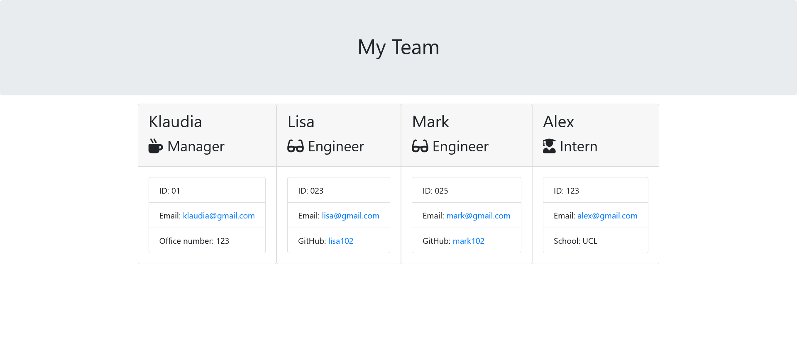

# Team-Profile-Generator

## Description

This project I made for user, who as manager wants to generate a webpage that displays my team's basic info so that a user have quick access to their emails and GitHub profiles.

## Installation

N/A

## Usage

To use the application, the user should enter the 'node index.js' command in the terminal and answer the question. HTML file named 'team.html' will be created from the given answers. File is ready to be deployed.

## Credits

N/A

## License

Please refer to the LICENSE in the repo

## Badges

N/A

## Features

N/A

## How to Contribute

N/A

## Link

https://klaudia102.github.io/Team-Profile-Generator/